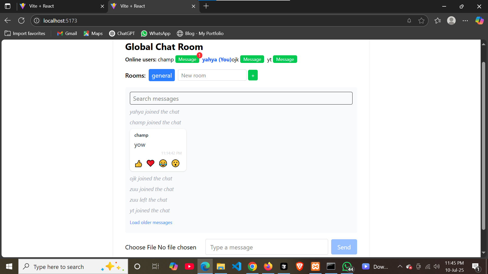
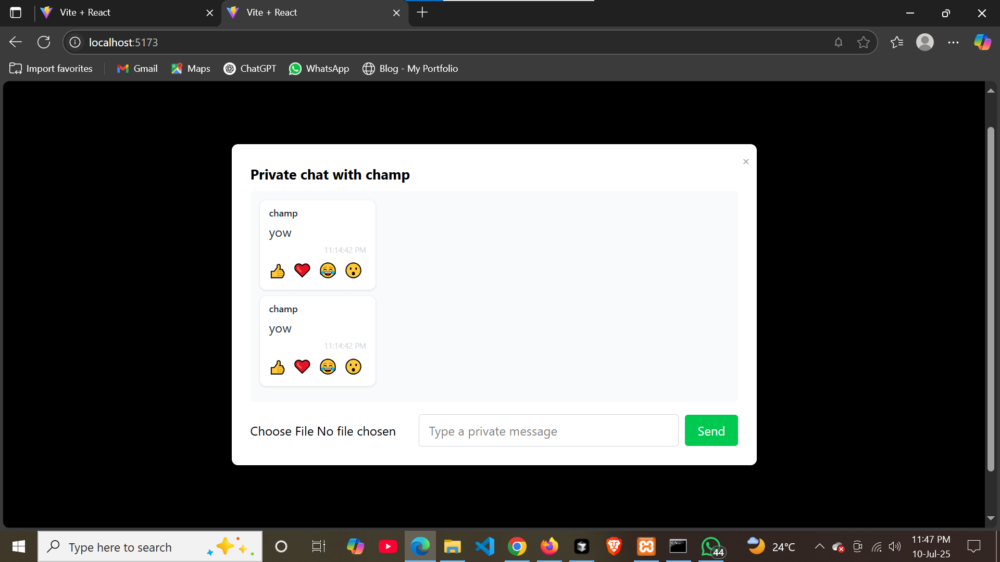
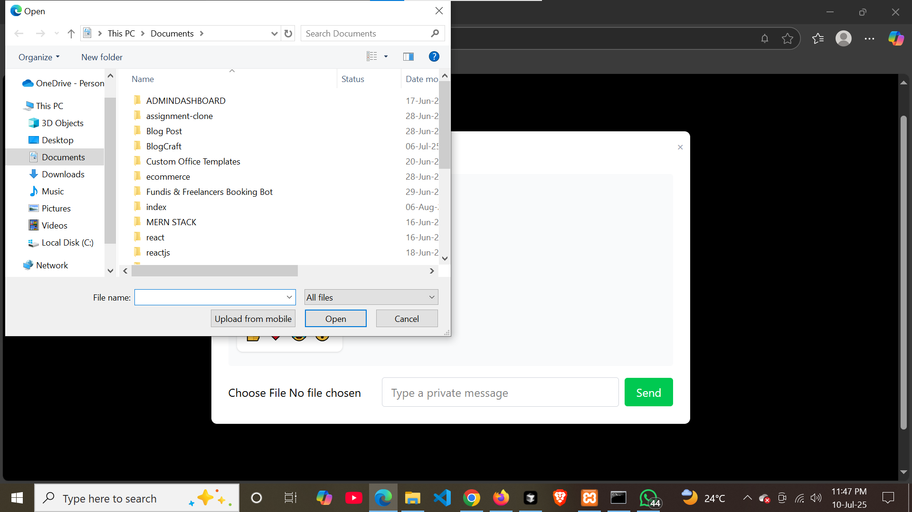

# Real-Time Chat Application

## 🚀 Project Overview
A modern, full-featured real-time chat application built with React, Node.js, Express, and Socket.io. This app demonstrates bidirectional communication, live messaging, notifications, private messaging, file/image sharing, and more. The UI is fully responsive and works seamlessly on both desktop and mobile devices.

---

## 🛠️ Setup Instructions

### 1. **Clone the repository**
```bash
git clone <your-repo-url>
cd week-5-web-sockets-assignment-Barmakyy
```

### 2. **Install dependencies with pnpm**
#### Server:
```bash
cd server
pnpm install
```
#### Client:
```bash
cd ../client
pnpm install
```

### 3. **Start the application**
#### Start the backend server:
```bash
cd server
pnpm run dev
```
#### Start the frontend React app:
```bash
cd ../client
pnpm start
```

- The server runs on [http://localhost:5000](http://localhost:5000) by default.
- The client runs on [http://localhost:5173](http://localhost:5173) by default.

---

## ✨ Features Implemented

### **Core Features**
- Simple username-based authentication
- Global chat room for all users
- Real-time messaging with sender and timestamp
- Typing indicators
- Online/offline user status

### **Advanced Features**
- **Private messaging** between users
- **Multiple chat rooms/channels** (create/join rooms)
- **Message reactions** (like, love, etc.)
- **File/image sharing** (send and view images/files in chat)
- **Read receipts** (see if your message was seen)
- **Real-time notifications** (in-app, sound, browser)
- **Unread message count** per room/private chat
- **Responsive design** for desktop and mobile
- **Message search** and pagination (load older messages)
- **Reconnection logic** and delivery acknowledgment

---

## 🖥️ How to Use
1. Open the app in your browser.
2. Enter a username to join the chat.
3. Join or create a chat room, or start a private chat with any online user.
4. Send messages, files, images, and react to messages.
5. See who is online, who is typing, and which messages have been seen.
6. Receive notifications for new messages, even when the app is in the background.

---

## 📸 Screenshots

### Global Chat Room


### Private Messaging


### File/Image Sharing



---

## 🙏 Credits & Acknowledgments
- Built with [React](https://reactjs.org/), [Express](https://expressjs.com/), and [Socket.io](https://socket.io/)
- UI styled with [Tailwind CSS](https://tailwindcss.com/)
- Assignment by MERN PLP FULL-STACK

---

## 📄 License
This project is for educational purposes.
